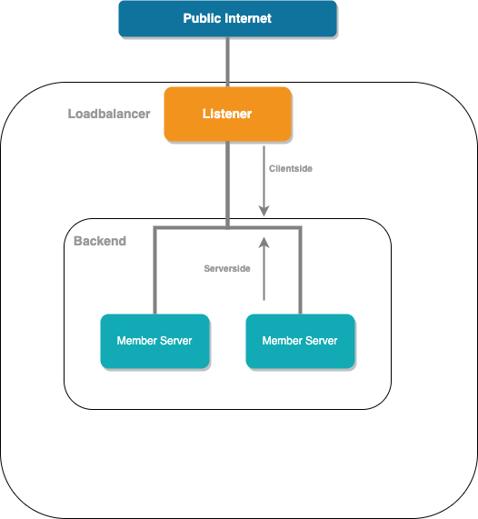
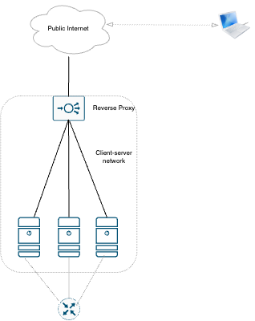
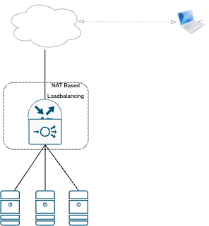
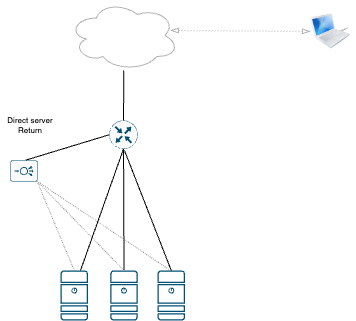
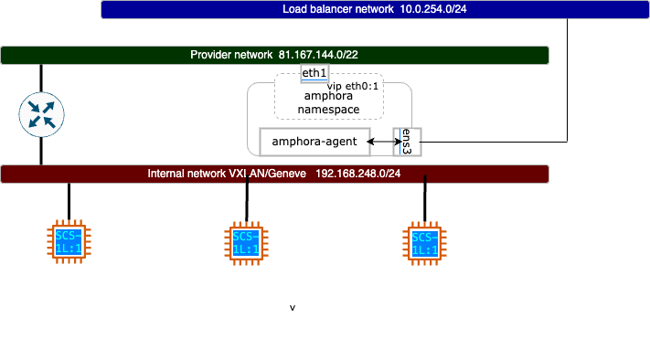

## 1. The Loadbalancer User story

The Terminology of Loadbalancing is a bundle of different types of
Loadbalancing, which is explained in the Section 2.

From an operator perspective, it is today possible to use LBaaS,
the SCS Stack shipped Octavia as LBaaS. But there are some open
questions. For some application use cases, audit trail or geolocating
protection it is helpful to be able to get origin source ip
in.

## 2. Terms of Loadbalancing

### 2.1 Definition of typical loadbalancer parts



### 2.1.1 Listener

A listener or virtual server can be a socket, an interface or a
ip address with a port definition. That is able to accept traffic.

### 2.1.2 Backend

A backend or a pool is a collective of member servers.
The listener represents the client-side and the backend
of the server-side.

### 2.1.3 Member server

A member server or real server is a ip and a port, that
represents a real, virtual instance or a container.It
could also be a local unix-socket.

### 2.1.4 Monitor

A monitor in the load balancer context means having a health check
that checks the service for availability of each member server.

### 2.2  Types of Loadbalancing

### 2.2.1  DNS Based Loadbalancing

DNS-based load balancing means, have a DNS A Record more than with one entry.

The DNS client cache will keep the first entry and the client will try to
reach the first destination. If the answer is incorrect, the client should
try to reach the next entry.

```console
www.example.org       A         1.2.3.4
www.example.org       A         4.3.2.1
```

But DNS servers do not know the backend state, as such DNS-based loadbalancing
is a very simplistic way of loadbalancing.

### 2.2.2 Reverse Proxy Loadbalancing



Reverse proxy is a form of loadbalancing, which terminates connections
and recreates a new client-server connection form the listener to
its own backend. This solution works well for HTTP, the HTTP protocol
contains mechanisms that can forward origin ip and port of origin.
This is specified in [RFC7239](https://www.rfc-editor.org/rfc/rfc7239.html).

For TCP connections this is a flawed workaround. TCP itself has no
mechanism to forwarded the origin source ip. TLS Termination works
for HTTP as well as TCP.

The expected performance footprint is minimal.

examples for this are:

* [haproxy.org](https://haproxy.org)
* [nginx.org](https://nginx.org)
* [traefik.io](https://traefik.io/)

### 2.2.3  Direct Routing (NAT Based) Loadbalancing



Direct Routing or Network Address Translation Loadbalancing is a form
of load balancing that provides the component directly on a network
gateway. The gateway is available as a standard gateway for the
member servers.

The NAT passes through the original source-ip packages, which then
provides a possibility for balancing decision based on the
L3 traffic. No header modification is required in the protocol.

The TLS termination for TCP should be negotiated directly at the
Backend application.

Another advantage is the use of a masked network CIDR, the servers
behind a NAT pool with more Client IP's can request on the Internet

The expected performance footprint is to be assessed as medium,
specifically for software defined networks considering the NAT
translation, it could become a bottleneck.

An example is:

* Linux Virtual Server (IPVS) kernel module
 - which is adapted by [keepalived](https://github.com/acassen/keepalived)

### 2.2.4  Direct Server Return Loadbalancing



Direct server return is located next to the gateway,
viewed from the architecture layer.

It is from the definition a "flat based" load balancer.
In view of the direction of the traffic flow, the original source
ip of incoming traffic passes from the "listener" as a client-side
and rewrites the client-side ip with the source of origin ip to
the server-side, the response of the responding member server
then follows the source of origin ip and passes the network default
gateway.


### 2.2.5  ECMP Loadbalancing

For this type of load balancing, the routing technique is used
to forward the traffic. In Wide Area Network (WAN) there is often the
possibility to have multiple data paths to the dedicated network hops.

The idea behind this concept is to have network redundancy,
with some of these data paths as a standby. This is controlled
by routing protocols based on metrics, for example by "costs"
where the data paths take place. With ECMP or in long form
Equal Path Multi Path is realized by inserting the route forward.
In the routing table of a router, hops are expanded with the same
"costs" to a single target. This means that you have an additional
form of scheduling mechanism manipulate the selected route.
ECMP is explained in detail in [RFC2992](https://www.rfc-editor.org/rfc/rfc2992).
The most widely used routing protocol is the Border Gateway Protocol (BGP),
which supports scaling for virtual services.

There various forms of loadbalancing. Two fairly prominent ways
are:

Round Robin: known as package-based load balancing

Session affinity: The loadbalacing is decided upon session initiated.

Routes to manipulate the flow through the first session decision.
This can be done with the schedulers round robin, hashed or least-conection.

## 2.3.  LBaaS in SCS Clouds

OpenStack brings octavia as its own load balancer as a service solution.
This can be activated as a service in SCS stacks. It works in two scenarios

### 2.3.1 Amphora Provider



The Amphora provider with HA-Instances with named amphora's.
Amphora works in a service OpenStack project either as an individual instance,
or better as a HA pair.

An amphora instance consists of an interface for management by octavia
control plane and an amphora name space to cope with load balancing
capability and the HA-VIP things themselves.
In the amphora-namespace itself work haproxy as reverse proxy for http,
tcp and TLS termination, ipvsadm for UDP and high availibility as VRRP.

### 2.3.2 OVN Provider
  
The second provider in Octavia works with the SDN integration
Open Virtual Network. Viewed from the architecture viewpoint, this design
is much simpler. The listener is just another router port in the
OpenStack Project Router. Logically it works as DSR based Loadbalancing,
which controlled by the Openflow definition of OVN.

OVN in a small showcase

```console
  openstack loadbalancer create --provider ovn --vip-subnet-id=subnet-test
  openstack loadbalancer set --name lb1 13f4ff79-0e58-4bf2-8ad6-c2dc0e1d15a3
  openstack loadbalancer pool create --name p1 --loadbalancer lb1 --protocol TCP --lb-algorithm SOURCE_IP_PORT
  openstack loadbalancer member create --address 192.168.112.122 --subnet-id 6816715b-53db-4322-a56a-31b5c537c1b8 --protocol-port 22 p1
  openstack loadbalancer listener create --name l1 --protocol TCP  --protocol-port 2222 --default-pool p1 lb1
```
