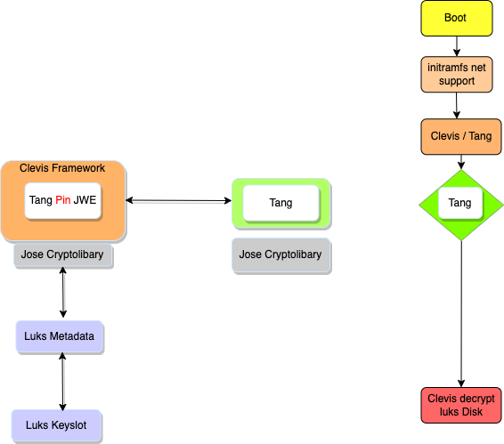

## NBDE

Network Bound Disk Encryption is a Method to handle automatically LUKS

## Motivation

for baremetal system in location such as datacenters. It should protected
against access data to data on storage media in case of lost or vendor lifecycle management.

## Proposal

NBDE should be an optional security feature for the SouvereignCloudStack's infrastructure,
to handle certification like C5 

## Technical requirements and features

the involved components:
    
* clevis -  is a JOSE'based pluggable framework which is handled automated luks encryption local 
            inside the boot procedure an is able to handle network base encryption or combine it
            other methods.

            https://github.com/latchset/clevis
                          
* tang  -   is a small webserver with the Jose library, which  is able response to clevis prepared
            encryption.chain and save  it as a key answer it with a advertisement request, Tang 
            relies on the JSON Object Signing and Encryption (JOSE) standards
           
            https://github.com/latchset/tang

* Jose -    is the Javascript Object Signing and Encryption  Framework, in NBDE context it.
            use an rsa based. Encryption.
            https://jose.readthedocs.io/

* LUKS -    is Linux Unified Key Setup and in Version 2 the default Linux Disk Encryption

* NBDE -    in detailed overview and boot procedure

