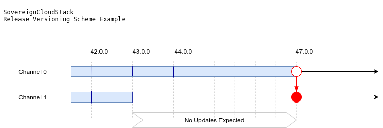

## Numbering scheme of the releases versions

### Motivation & Goals

In order to have a common understanding of how release versioning works,
we wanted to create a support document to make it easier to use.

Following the KISS principle, we strive for an easy model with automatic
updates and different schedules per channel in mind.

Regardless, we still require operators to read the release notes for
certain features, bug fixes, and sometimes inevitable breaking changes.

### Release Tags vs Release Version

The release tags (R0, R1, ...) of the SCS point to their corresponding
release version, which can change if, for example, a later hotfix
version is deemed necessary.

Think of the "Release Tag" as the name and the "Release Version" as the
point in time.

### Numbering Syntax

```xml
> v\<ongoing release version>.\<channel>.\<ongoing hotfix version>
```

#### Regex

```regex
> v\[0-9\]+.\[0-9\].\[0-9\]+
```

#### Channels

future use is tbd = atm fixed value of 0

### Examples



|         | **v42.0.0** | **v42.0.3** | ... | **v47.0.0** |
| ------- | ----------- | ----------- | --- | ----------- |
| version | 42          | 42          |     | 47          |
| channel | 0           | 0           |     | 0           |
| hotfix  | 0           | 3           |     | 0           |

### Relationship between Release Versions and Subproject Versioning

tbd. see GH-28
