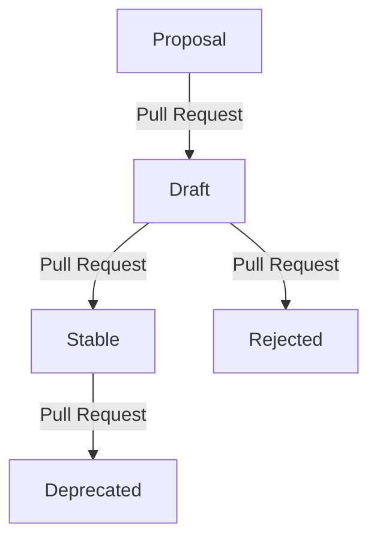

# Introduction

The [Sovereign Cloud Stack (SCS)](https://scs.community) provides standards
for a range of cloud infrastructure types.
It strives for interoperable and sovereign cloud stacks
which can be deployed and used by a wide range of organizations and individuals.
Whereever feasible,
transparency and openness both in respect to the inner workings of the platforms standardised by SCS,
as well as the SCS organisation itself
are a paradigm we intend to live.

# Requirements

The key words "MUST", "MUST NOT", "REQUIRED", "SHALL", "SHALL NOT", "SHOULD", "SHOULD NOT", "RECOMMENDED", "MAY", and "OPTIONAL" in this document are to be interpreted as described in [RFC 2119](https://datatracker.ietf.org/doc/html/rfc2119).

In addition, "FORBIDDEN" is to be interpreted equivalent to "MUST NOT".

# Sovereign Cloud Standard documents

One of the main products of the SCS organisation are Sovereign Cloud Standard documents.

## Types of documents

### Procedural

A procedural SCS document describes a process, a policy or a guideline
to which the SCS community adheres.

### Standard

A standard SCS document describes a technical standard for SCS compliant clouds.
Note that it may not be necessary for all clouds to implement all standards.

### Decision Record

Sometimes during the development of the SCS standard,
a complex technical decision needs to be taken,
which does not directly result in a new standard.

The SCS document format formally integrates
the documentation of such decisions
as documents of type `Decision Record`.

## Document format

The SCS documents are provided in GitHub flavored markdown.
Each document is assigned a unique number.
To disambiguate with other organisations using similar schemes
(such as XEPs, PEPs or IETF RFCs),
the numbers are prefixed with `SCS-`.

To allow a concept to evolve while allowing breaking changes,
each SCS document is associated with a major version number.
This major version number is a positive number
and the numbering starts at one for each document.

In order to make organisation of the SCS documents easier,
each document also has a slugified title.
The slugified title MUST NOT be changed after the acceptance of the document into the repository,
as it is part of its canonical URL.
It MUST consist only of lower-case ASCII letters, numbers and hyphens.
It MUST NOT start with a hyphen and SHOULD start with a lower-case letter.
It SHOULD NOT contain more than one subsequent hyphen.

The file name of an SCS document is formed using the following pattern:
`scs-XXXX-vN-T.md`, where
`XXXX` is replaced with the zero-padded document number,
`N` is replaced with the major version of the document, and
`T` is replaced with the slugified title.
For a document with the number 390, with a major version number 2 and a slugified title `flavor-naming`,
the resulting file name would be `scs-0390-v2-flavor-naming.md`.

In addition to the number, each document has the following metadata,
embedded in the markdown header.

| Field name | Requirement | Description |
| --- | --- | --- |
| `type` | REQUIRED | one of `Procedural`, `Standard`, or `Decision Record` |
| `status` | REQUIRED | one of `Proposal`, `Draft`, `Stable`, `Deprecated`, or `Rejected` |
| `track` | REQUIRED | one of `Global`, `IaaS`, `Ops`, `KaaS`, `IAM` |
| `obsoleted_at` | REQUIRED if `status` is `Deprecated` | ISO formatted date indicating the date after which the deprecation is in effect |
| `stabilized_at` | REQUIRED if `status` was ever `Stable` | ISO formatted date indicating the date after which the document was considered stable |
| `rejected_at` | REQUIRED if `status` is `Rejected` | ISO formatted date indicating the date on which the document was rejected |
| `replaced_by` | RECOMMENDED if `status` is `Deprecated` or `Rejected`, FORBIDDEN otherwise | List of documents which replace this document. |
| `replaces` | OPTIONAL | List of documents which this document replaces. |

## Sections

Each document SHOULD have the following sections:

- An *Introduction* providing context on the document and linking to other relevant materials.
- A *Motivation* section which details why this document or the thing it describes is necessary.

In addition, the following OPTIONAL sections should be considered:

- A *Design Considerations* section for Standard type documents,
  which details other choices
  which have been considered for the specific feature
  but were ultimately rejected.
- An *Open Questions* section which links to issues
  detailing any open discussion points with respect to a document.
  This section is RECOMMENDED during the discussion phase (pre 1.0.0)
  as a "table of contents" of things to work on in that context.
- A *Related Documents* section which references related Standards
  or Decisions, both upstream and/or other SCS documents.
- A *Conformance Tests* section that contains hints on how to validate
  conformance with this spec, ideally links to conformance test cases.

# Process

The lifecycle of an SCS document goes through the following phases:
Proposal, Draft, Stable, Deprecated, and Rejected.

All decisions for phase transitions follow loose consensus,
where the group which has to form the consensus depends on the `track` of the document:

- IaaS: The team working on infrastructure-as-a-service topics
- KaaS: The team working on Kubernetes-as-a-service topics
- Ops: The team working on operations topics
- IAM: The team working on idenity and access management topics
- Global: The entire SCS community

## Proposal phase

### Proposal of a new document

To propose a new SCS document,
a community participant creates a pull request on GitHub
against the [standards repository in the SovereignCloudStack organisation](https://github.com/SovereignCloudStack/standards).

The pull request MUST add exactly one SCS document,
in the `Standards` folder.
In the proposal phase,
the document number MUST be replaced with `xxxx` in the file name.
The major version MUST be 1.

For a document with a slugified title `flavor-naming`,
the file name would for instance be `scs-xxxx-v1-flavor-naming.md`.

The metadata MUST indicate the intended `track` and `type` of the document,
and the `status` MUST be set to `Proposal`.

Upon acceptance by the group of people identified by the `track`,
a number is assigned
(the next unused number)
and the proposer is asked
to rename the file to replace the `xxxx` with that number.

**Note:**
Documents on the `Design Record` track MAY be proposed or accepted directly into `Stable` state,
if no further discussion is required.

Hereafter,
the pull request can be merged
and henceforth the document is an official SCS document in `Draft` state.

### Proposal of a major update to a stable document

To propose major update to a Stable SCS document,
a community participant creates a pull request on GitHub
against the [standards repository in the SovereignCloudStack organisation](https://github.com/SovereignCloudStack/standards).

The pull request MUST add exactly one SCS document,
in the `Standards` folder.
The document number MUST be the same as the document it is updating,
and the major version number MUST be incremented by 1.
The slugified title MAY be changed.

It MUST refer to the old document in its `replaces` metadata.
The pull request SHOULD NOT modify the previous document;
deprecation of the previous document
as well as adding the `replaced_by` metadata is a separate step,
and can only be executed once the new document is `Stable`.

For a document updating a hypothetical SCS-0390-v3 document,
the file name may be `scs-0390-v4-flavor-naming-this-time-its-serious.md`.

Other than the file naming difference,
the proposal process is the same as for new documents.
In particular, the new document starts out in `Draft` state
and does not automatically become part of the normative corpus of an SCS release.

## Development phase (Draft)

In this phase,
the document is developed inside the SCS community.

It should not be considered to be normative for any SCS release,
even if an SCS release happens after the acceptance of the document.

Experimental and exploratory implementations are encouraged,
however, implementors must be prepared for breaking changes.

Changes to the documents are gated through pull requests.

## Stabilized phase (Stable)

Once the document is deemed ready for production use,
its `status` is changed to `Stable`.
Once the next SCS release happens,
the document is officially part of the SCS standard.

After stabilization,
changes to the document which may render existing implementations non-conformant
MUST NOT be made.

If a breaking change to an existing SCS document is deemed necessary,
a new document with a new number shall be created
and the old document SHOULD be deprecated.

## Deprecation phase (Deprecated)

Should a document become obsolete,
it can be deprecated.

Obsoletions SHOULD be announced ahead of their execution by setting the
`deprecated_at` field to a future date and moving the `status` to `Deprecated`.
This signals current and future implementors
that the subject matter of the document
is not considered necessary or state of the art anymore.

If one or more replacement documents for the document exists,
it MUST be listed in the `replaced_by` metadata field.

## Rejection

If a document is removed from the normative corpus of SCS standards,
its status is changed to `Rejected`.

If one or more replacement documents for the document exists,
it MUST be listed in the `replaced_by` metadata field.

# Open Questions

## Stabilization criteria

When should a document be stabilized?
Should we require at least one public implementation?
Should we require a minimum experimental time?
What about non-Standard track documents?

## Breaking change criteria

When is a change breaking and cannot be applied to a Stable document?
What about previously undefined behaviour (uncovered edge case)?
What about ambiguous wording?
Do we need a separate "Errata" section?

# Design Considerations

## Versioning

An alternative to the proposed scheme for stabilization
is the use of [SemVer-like][semver] versioning.

In that case, one would have an individual version number with each document,
where a major version greater than zero indicates a stable document.
The `Stable` state would be merged with `Draft` state into an *Active* state
and shared between the stabilized and the development phase.

The advantages of such an approach are:

- It is easy to recognize whether an SCS document has changed between two SCS
  releases, just by looking at the released version number.
- It is possible to make breaking changes after stabilization by increasing the
  major version number.

The disadvantages of that approach are:

- It is possible to make breaking changes after stabilization.
  Potentially, an hypothetical SCS-1234 document might refer to something completely different
  in a hypothetical R15 release than what it meant in R5,
  if there have been sufficient, gradual breaking changes to the document.

  That means that for proper linking,
  it would be required to always include the major version number
  when referring to an SCS document.

  This implies having to keep all former versions around in a canonical, linkable form.
  This induces non-trivial organzational and editorial overhead
  and raises questions around which changes are acceptable to "archived" versions,
  if any.

- It would require a clone of the SemVer spec,
  as that spec is highly specific toward software
  and does not fully
  (at least not in the standard-as-written)
  cover specifics of a standards organisation's use-cases.

# Acknowledgements

This document is heavily inspired by [XEP-0001](https://xmpp.org/extensions/xep-0001.html), as published by the XMPP Standards Foundation.

   [semver]: https://semver.org/
