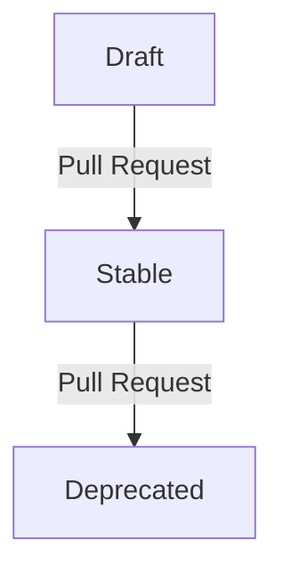

## Introduction

The [Sovereign Cloud Stack (SCS)](https://scs.community) provides standards for a range of cloud infrastructure types.
It strives for interoperable and sovereign cloud offerings which can be deployed and used by a wide range of organizations and individuals.

SCS plans to offer six types of certificates, which are sorted into two dimensions:

1. _certification level_, of which there are three:
   - SCS-compatible
   - SCS-open
   - SCS-sovereign
2. _cloud layer_, of which there are two:
   - infastructure as a service (IaaS)
   - Kubernetes as a service (KaaS)

So, for instance, a certificate can be of type _SCS-compatible IaaS_ or _SCS-sovereign KaaS_.

Each type of certificate amounts to a set of standards that have to be fulfilled by the cloud service in question in order for a certificate to be issued.
In addition, a certificate of a certain type may only be issued if some other certificate is already held.
Case in point: the certification levels are meant to be seen as a progression, where the upper levels build on the lower ones, and
the certificate for "SCS-open IaaS" will only be issued if a certificate for "SCS-compatible IaaS" is already held.
We say that the latter certificate is a _prerequisite_ of the former.

Naturally, as the state of the art progresses, so do our certificates. We keep track of the changes by means of versioning.
That is to say that each certificate type can come in several versions, each one of them having its distinct timespan when it is in effect.
For instance, we might have

- SCS-compatible IaaS v1, effective 2021-01-01 through 2023-10-31
- SCS-compatible IaaS v2, effective 2023-03-23 through 2023-11-30

and so on (but usually, we aim to keep at most two versions in effect, with an overlap of 4 to 6 weeks).

This decision record describes two main points:

1. How we denote our certificate types by means of a YAML file.
2. Our process for constructing and progressing the certificate types.

## Motivation

This decision record establishes a mechanism (by means of the YAML file) with the following three main objectives:

- to provide an overview of the mandatory standards for the different SCS certificate types
- to make the lifecycle of certificate types traceable
- to provide a machine-readable document for further processing (e.g. for a compliance tool suite or continuous integration).

### Overview of mandatory SCS standards

Digging through a repository of draft, stable, replaced and rejected standards becomes increasingly challenging with a growing number
documents and decision records. A central document that lists all mandatory standards to acquire a certificate of a certain type can
resolve this issue. It provides clarity for providers as well as users and helps to understand the value
proposition of SCS.

### Lifecycle of certificate types

Standards and therefore certifications will evolve over time. To provide transparency and traceability for the lifecycle of SCS certificate
types, the whole history of our certifications should be recorded. Pre-notification of changes to our certificate types allows
users to adapt their environments or deployment automation to the new standards in advance.

### Machine-readability for further processing

By providing a machine-readable document, we can generate web-friendly overviews of our certificate types as well as create a tool suite
that checks environments against all described standards.

## SCS Certification YAML

Every certification level is recorded in a dedicated YAML file, e.g. `scs-open.yaml`.

The certification YAML _MUST_ contain the following keys:

| Key    | Type   | Description                                          | Example                                                                                  |
| ------ | ------ | ---------------------------------------------------- | ---------------------------------------------------------------------------------------- |
| `name` | String | Full name of this certification level                | _SCS Open_                                                                               |
| `url`  | String | Valid URL to the latest raw version of this document | _<https://github.com/SovereignCloudStack/standards/blob/main/Tests/scs-compatible.yaml>_ |

The certification YAML _MAY_ contain the following keys:

### Dependency

Standards that are required by lower certification levels shouldn't be included in higher tier certification levels again. We thus need to note
on which certification this level is depending on.

| Key               | Type   | Description                                                               | Example                                                                                                       |
| ----------------- | ------ | ------------------------------------------------------------------------- | ------------------------------------------------------------------------------------------------------------- |
| `depends_on`      | Map    | Preliminary certification level on which this certification level depends |                                                                                                               |
| `depends_on.name` | String | Full name of the depending certification level                            | _SCS Compatible_                                                                                              |
| `depends_on.url`  | String | Valid URL to the latest raw version of the depending certification level  | _[scs-compatible.yaml](https://github.com/SovereignCloudStack/standards/blob/main/Tests/scs-compatible.yaml)_ |

### Layers

The Sovereign Cloud Stack project is compiled of several layers: Infrastructure and Container. Every layer may include different
mandatory or optional standards. Every layer is noted as a dedicated map in the certification YAML.

| Key    | Type  | Description                                                | Example |
| ------ | ----- | ---------------------------------------------------------- | ------- |
| `iaas` | Array | List of versioned sets of SCS standards for the IaaS layer |         |
| `kaas` | Array | List of versioned sets of SCS standards for the KaaS layer |         |

Note that we don't currently have separate certification layers for Operations and IAM.
We expect that tests for these aspects will exist, but be incorporated into the IaaS
and KaaS layers.

### Set of standards

Every layer keeps record of the whole history of defined standards in a `version` map item.

| Key                 | Type          | Description                                 | Example |
| ------------------- | ------------- | ------------------------------------------- | ------- |
| `{layer}.version`   | String        | Version of the particular list of standards | _v3_    |
| `{layer}.standards` | Array of maps | List of standards for this particular layer |         |

### Time evolution

Every version of the standard has a date at which it is effective (`stabilized_at`)
and may have an expiration date (`obsoleted_at`).

| Key                     | Type | Description                                                                                                                                                           | Example      |
| ----------------------- | ---- | --------------------------------------------------------------------------------------------------------------------------------------------------------------------- | ------------ |
| `{layer}.stabilized_at` | Date | ISO formatted date indicating the date after which the set of standards of this version was considered stable. Mandatory for standards that have ever been in effect. | _2022-11-09_ |
| `{layer}.obsoleted_at`  | Date | ISO formatted date indicating the date on which this version of the standard can no longer be used for certification                                                  | _2023-04-09_ |

Note that at any point in time, all versions that are older (`stabilized_at` is at or before this point)
can be certified against, unless the version is already obsoleted (the point is after `obsoleted_at`).
This means that more than one version may be allowable at a certain point in time. Tooling should default
to use the newest allowable version (the one with the most recent `stabilized_at` date) then.

Note: We intend to keep only one version in effect, except for a grace period of 4 to 6 weeks, when two versions
are effective at the same time.

### Standards

Every list of standards consists of several standards that – altogether – define the particular layer standard in the given version.

| Key                                        | Type   | Description                                                                                                                                                                                                              | Example                                                                                                              |
| ------------------------------------------ | ------ | ------------------------------------------------------------------------------------------------------------------------------------------------------------------------------------------------------------------------ | -------------------------------------------------------------------------------------------------------------------- |
| `{layer}.standards.name`                   | String | Full name of the particular standard                                                                                                                                                                                     | _Flavor naming_                                                                                                      |
| `{layer}.standards.url`                    | String | Valid URL to the latest raw version of the particular standard                                                                                                                                                           | _[Flavor naming](https://github.com/SovereignCloudStack/standards/blob/main/Standards/scs-0100-v2-flavor-naming.md)_ |
| `{layer}.standards.condition`              | String | State of the particular standard, currently either `mandatory` or `optional`, default is `mandatory`                                                                                                                     | _mandatory_                                                                                                          |
| `{layer}.standards.check_tools`            | Array  | List of `url`, `args` maps that list all tools that must pass                                                                                                                                                            |                                                                                                                      |
| `{layer}.standards.check_tools.executable` | String | Valid local filename (relative to the path of scs-compliance-check.py) or URL to the latest check tool that verifies compliance with the particular standard. (URL is not yet supported due to security considerations.) | _image-md-check.py_                                                                                                  |
| `{layer}.standards.check_tools.args`       | String | _Optional_ list of arguments to be passed to the `check_tool`. Preferably none needed.                                                                                                                                   | `-v`                                                                                                                 |
| `{layer}.standards.check_tools.condition`  | String | _Optionally_ overrides the per-standard condition (`mandatory` or `optional`)                                                                                                                                            | _optional_                                                                                                           |

### Basic Example

```yaml
name: SCS Open
url: https://raw.githubusercontent.com/SovereignCloudStack/Docs/main/Certification/scs-open.yaml
depends_on:
  name: SCS Compatible
  url: https://raw.githubusercontent.com/SovereignCloudStack/standards/main/Tests/scs-compatible.yaml
iaas:
  - version: v5 # This version is in a draft state and work in progress
    # No stabilized_at: date set yet
    standards:
      - name: Flavor naming
        url: https://raw.githubusercontent.com/SovereignCloudStack/standards/main/Standards/scs-0100-v2-flavor-naming.md
        condition: mandatory # is default and can be left out
        check_tools:
          - executable: flavor-name-check.py
      - name: Image metadata
        url: https://raw.githubusercontent.com/SovereignCloudStack/Docs/main/Standards/SCS-0004-v1-image-metadata.md
        condition: mandatory
        check_tools:
          - executable: image-md-check.py
            args: -v
          - executable: image-md-check2.py
            condition: optional
  - version: v4 # This is the upcoming version with a given target date. No further changes should be done to this set of standards
    stabilized_at: 2022-04-01
    standards:
      - name: ....

  - version: v3 # This is the stable set of standards that is currently active
    stabilized_at: 2021-10-01
    obsoleted_at: 2022-11-08
    standards:
      - name: ....

  - version: v2 # This set of standards is obsolete and has been replaced by v3
    stabilized_at: 2021-07-01
    obsoleted_at: 2021-11-01
    standards:
      - name: ....
kaas:
  - ...
```

## Process

The lifecycle any version of any type of certificate goes through the following phases:
Draft, Stable, and Deprecated.



Note that one pull request can affect multiple versions, but each pull request has to affect
at most one layer.

Each pull request is to be voted upon in the corresponding team meeting. The vote has to be
on the pull request only, i.e., it may not affect any other pull request or issue, and it
must be announced 14 days in advance via the corresponding mailing list.

## Design Considerations

### File format

In order to have a document that can be processed by a wide range of tools, we need to opt for a simple but yet well supported format.
YAML offers readability for humans as well as good support by many frameworks. Since YAML is heavily used in the cloud and container
domain, the choice is obvious.

### Dependency graph for certifications

This standard only allows exactly one depending certification, otherwise we would need to use a list of mappings. Since this is
in accordance to the current plan of the SIG Standardization & Certification, we can safely ignore multiple dependency of
certification for now.

## Tooling

The SCS repository Docs has a tool `scs-compliance-check.py` in the `Design-Docs/tools` directory
which parses the SCS Certification YAML and then runs the tests referenced there, returning the results
of the tests.

## Open Questions

## Acknowledgements

This document is heavily inspired by the [publiccode.yml standard](https://yml.publiccode.tools/), as published by the [Foundation for Public Code](https://publiccode.net/).
