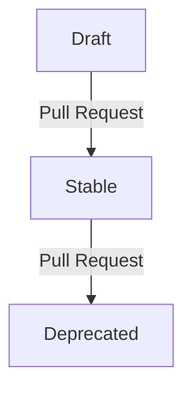

## Introduction

The [Sovereign Cloud Stack (SCS)](https://scs.community) provides standards for a range of cloud infrastructure types.
It strives for interoperable and sovereign cloud offerings which can be deployed and used by a wide range of organizations and individuals.

SCS plans to offer six kinds of certificates with varying scope. These scopes can be sorted into two dimensions:

1. _certification level_, of which there are three:
   - SCS-compatible
   - SCS-open
   - SCS-sovereign
2. _cloud layer_, of which there are two:
   - infastructure as a service (IaaS)
   - Kubernetes as a service (KaaS)

So, for instance, a certificate can have the scope _SCS-compatible IaaS_ or _SCS-sovereign KaaS_.
Note that we don't currently have separate certification layers for Operations and IAM.
We expect that tests for these aspects will exist, but be incorporated into the IaaS
and KaaS layers.

Each certificate scope amounts to a set of standards that have to be fulfilled by the cloud service in question in order for a certificate to be issued.
In addition, a certificate with a certain scope may only be issued if some other certificate is already held.
Case in point: the certification levels are meant to be seen as a progression, where the upper levels build on the lower ones, and
the certificate for "SCS-open IaaS" will only be issued if a certificate for "SCS-compatible IaaS" is already held.
We say that the latter certificate is a _prerequisite_ of the former.

Naturally, as the state of the art progresses, so do our certificates. We keep track of the changes by means of versioning.
That is to say that each certificate scope can come in several versions, each one of them having its distinct timespan when it is in effect.
For instance, we might have

- SCS-compatible IaaS v1, effective 2021-01-01 through 2023-10-31
- SCS-compatible IaaS v2, effective 2023-03-23 through 2023-11-30

and so on (but usually, we aim to keep at most two versions in effect, with an overlap of 4 to 6 weeks).

This decision record describes two main points:

1. How we denote our certificate scopes by means of a YAML file.
2. Our process for constructing and progressing the certificate scopes.

## Motivation

This decision record establishes a mechanism (by means of the YAML file) with the following three main objectives:

- to provide an overview of the mandatory standards for the different SCS certificate scopes
- to make the lifecycle of certificate scopes traceable
- to provide a machine-readable document for further processing (e.g. for a compliance tool suite or continuous integration).

### Overview of mandatory SCS standards

Digging through a repository of draft, stable, replaced and rejected standards becomes increasingly challenging with a growing number
documents and decision records. A central document that lists all mandatory standards to acquire a certificate with a certain scope can
resolve this issue. It provides clarity for providers as well as users and helps to understand the value
proposition of SCS.

### Lifecycle of certificate scopes

Standards and therefore certifications will evolve over time. To provide transparency and traceability for the lifecycle of SCS certificate
scopes, the whole history of our certifications should be recorded. Pre-notification of changes to our certificate scopes allows
users to adapt their environments or deployment automation to the new standards in advance.

### Machine-readability for further processing

By providing a machine-readable document, we can generate web-friendly overviews of our certificate scopes as well as create a tool suite
that checks environments against all described standards.

## SCS Certification YAML

Each certificate scope is recorded in a dedicated YAML file, e.g. `scs-open-kaas.yaml`.

The certification YAML _MUST_ contain the following keys:

| Key        | Type          | Description                                          | Example                                                                                         |
| ---------- | ------------- | ---------------------------------------------------- | ----------------------------------------------------------------------------------------------- |
| `name`     | String        | Full name of this certificate scope                  | _SCS Open KaaS_                                                                                 |
| `url`      | String        | Valid URL to the latest raw version of this document | `https://raw.githubusercontent.com/SovereignCloudStack/standards/main/Tests/scs-open-kaas.yaml` |
| `versions` | Array of maps | List of version descriptors (described below)        | (see below)                                                                                     |

The certification YAML _MAY_ contain the following keys:

| Key                 | Type               | Description                                                   |
| ------------------- | ------------------ | ------------------------------------------------------------- |
| `prerequisite`      | Map                | Descriptor for the prerequisite certificate scope (see below) |
| `variables`         | Array of String    | Lists variables that may occur in check tool descriptors      |

The main check tool will expect an assignment for these variables (which is specific to the subject under test), and every occurrence of the variable in the check tool descriptor will be substituted accordingly.

### Prerequisite descriptor

A certificate within a certain level (above SCS-compatible) can only be granted if a valid corresponding certificate of the level below is presented,
where corresponding means: of the same layer. The latter certificate is said to be a prerequisite for the former.

We implement this logic by allowing for the designation of a certificate scope as a prerequisite;
then a certificate of that prerequisite scope has to be presented before the certificate of the scope in question can be granted.

| Key    | Type   | Description                                                   | Example                                                                                                                           |
| ------ | ------ | ------------------------------------------------------------- | --------------------------------------------------------------------------------------------------------------------------------- |
| `name` | String | Full name of the certificate scope                            | _SCS Compatible IaaS_                                                                                                             |
| `url`  | String | Valid URL to the latest raw version of the certificate scope  | _[scs-compatible-iaas.yaml](https://raw.githubusercontent.com/SovereignCloudStack/standards/main/Tests/scs-compatible-iaas.yaml)_ |

### Version descriptor

| Key             | Type          | Description                                                                     | Example      |
| --------------- | ------------- | ------------------------------------------------------------------------------- | ------------ |
| `version`       | String        | Mandatory: Version of the particular list of standards                          | _v3_         |
| `standards`     | Array of maps | Mandatory: List of standard descriptors for this particular layer               |              |
| `stabilized_at` | Date          | ISO formatted date indicating the date after this version is considered stable. | _2022-11-09_ |
| `deprecated_at`  | Date          | ISO formatted date indicating the date on which this version is expired.        | _2023-04-09_ |

Once a version has a `stabilized_at` field, this field may not be changed. The same holds true for the `deprecated_at` field.

Note that at any point in time, all versions that are older (`stabilized_at` is at or before this point)
can be certified against, unless the version is already deprecated (the point is after `deprecated_at`).
This means that more than one version may be allowable at a certain point in time. Tooling should default
to use the newest allowable version (the one with the most recent `stabilized_at` date) then.

Note: We intend to keep only one version in effect, except for a grace period of 4 to 6 weeks, when two versions
are effective at the same time.

### Standard descriptor

Every list of standards consists of several standards that – altogether – define the particular layer standard in the given version.

| Key                      | Type   | Description                                                                                            | Example                                                                                                                        |
| ------------------------ | ------ | ------------------------------------------------------------------------------------------------------ | ------------------------------------------------------------------------------------------------------------------------------ |
| `name`                   | String | Full name of the particular standard                                                                   | _Flavor naming_                                                                                                                |
| `url`                    | String | Valid URL to the latest raw version of the particular standard                                         | _[Flavor naming](https://raw.githubusercontent.com/SovereignCloudStack/standards/main/Standards/scs-0100-v2-flavor-naming.md)_ |
| `condition`              | String | State of the particular standard, currently either `mandatory` or `optional`, default is `mandatory`   | _mandatory_                                                                                                                    |
| `checks`                 | Array  | List of all checks that must pass; each entry being a check descriptor                                 |                                                                                                                                |

### Check descriptor

The following fields are valid for every check descriptor:

| Key               | Type   | Description                                                                                                                              | Example                |
| ----------------- | ------ | ---------------------------------------------------------------------------------------------------------------------------------------- | ---------------------- |
| `id`              | String | Identifier for this check (immutable and unique within this version of the certificate scope)                                            | image-md-check         |
| `condition`       | String | _Optionally_ overrides the per-standard condition (`mandatory` or `optional`)                                                            | _optional_             |
| `lifetime`        | String | One of: `day` (_default_), `week`, `month`, `quarter`; the test result is valid until the end of the next period                         | _week_                 |
| `section`         | String | _Optional_ what section to associate this check with (sections can be checked in isolation); default: equal to lifetime                  | _flavor-name syntax_   |

Additional fields are valid depending on whether the check is automated or manual.

#### Automated check

| Key               | Type   | Description                                                                                                                              | Example                |
| ----------------- | ------ | ---------------------------------------------------------------------------------------------------------------------------------------- | ---------------------- |
| `executable`      | String | Valid local filename (relative to the path of scs-compliance-check.py) of a script that verifies compliance with the particular standard | _image-md-check.py_    |
| `env`             | Map    | _Optional_ key-value map of environment variables (values may use variables)                                                             | `OS_CLOUD: {os_cloud}` |
| `args`            | String | _Optional_ command-line arguments to be passed to the `check_tool` (may use variables)                                                   | `-v -k {kubeconfig}`   |

As mentioned, variables may be used within `env` and `args`; they are enclosed in single braces, like so: `{var}`.
If a brace is desired, it needs to be doubled: `{{` will be turned into `{`. When the main check tool is run,
each occurrence of a variable will be substituted for according to the variable assignment for the subject under test.

_Note_: the `executable` could in principle also be given via a URL; however, this is not yet supported due to security considerations.

#### Manual check

TBD

### Basic Example

```yaml
name: SCS Open IaaS
url: https://raw.githubusercontent.com/SovereignCloudStack/Docs/main/Certification/scs-open-iaas.yaml
prerequisite:
  name: SCS Compatible IaaS
  url: https://raw.githubusercontent.com/SovereignCloudStack/standards/main/Tests/scs-compatible-iaas.yaml
variables:
  - os_cloud
versions:
  - version: v5 # This version is in a draft state and work in progress
    # No stabilized_at: date set yet
    standards:
      - name: Flavor naming
        url: https://raw.githubusercontent.com/SovereignCloudStack/standards/main/Standards/scs-0100-v2-flavor-naming.md
        condition: mandatory # is default and can be left out
        checks:
          - executable: flavor-name-check.py
            env:
              OS_CLOUD: "{os_cloud}"
            id: flavor-name-check
            lifetime: day
      - name: Image metadata
        url: https://raw.githubusercontent.com/SovereignCloudStack/Docs/main/Standards/SCS-0004-v1-image-metadata.md
        condition: mandatory
        checks:
          - executable: image-md-check.py
            args: -c {os_cloud} -v
            id: image-md-check
            lifetime: day
          - executable: image-md-check2.py
            condition: optional
            id: image-md-check-2
            lifetime: day
  - version: v4 # This is the upcoming version with a given target date. No further changes should be done to this set of standards
    stabilized_at: 2022-04-01
    standards:
      - name: ....

  - version: v3 # This is the stable set of standards that is currently active
    stabilized_at: 2021-10-01
    deprecated_at: 2022-11-08
    standards:
      - name: ....

  - version: v2 # This set of standards is obsolete and has been replaced by v3
    stabilized_at: 2021-07-01
    deprecated_at: 2021-11-01
    standards:
      - name: ....
```

## Process

The lifecycle any version of any certificate scope goes through the following phases:
Draft, Stable, and Deprecated.



Note that one pull request can affect multiple versions, but each pull request has to affect
at most one layer.

Each pull request is to be voted upon in the corresponding team meeting. The vote has to be
on the pull request only, i.e., it may not affect any other pull request or issue, and it
must be announced 14 days in advance via the corresponding mailing list.

## Design Considerations

### File format

In order to have a document that can be processed by a wide range of tools, we need to opt for a simple but yet well supported format.
YAML offers readability for humans as well as good support by many frameworks. Since YAML is heavily used in the cloud and container
domain, the choice is obvious.

### Dependency graph for certifications

This standard only allows exactly one depending certification, otherwise we would need to use a list of mappings. Since this is
in accordance to the current plan of the SIG Standardization & Certification, we can safely ignore multiple dependency of
certification for now.

## Tooling

The SCS repository Docs has a tool `scs-compliance-check.py` in the `Tests` directory
which parses the SCS Certification YAML and then runs the tests referenced there, returning the results
of the tests.

## Open Questions

## Acknowledgements

This document is heavily inspired by the [publiccode.yml standard](https://yml.publiccode.tools/), as published by the [Foundation for Public Code](https://publiccode.net/).
