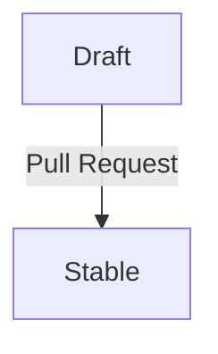

## Introduction

The [Sovereign Cloud Stack (SCS)](https://scs.community) provides standards for a range of cloud infrastructure types.
It strives for interoperable and sovereign cloud offerings which can be deployed and used by a wide range of organizations and individuals.

SCS plans to offer six kinds of certificates with varying scope. These scopes can be sorted into two dimensions:

1. _certification level_, of which there are three:
   - SCS-compatible
   - SCS-open
   - SCS-sovereign
2. _cloud layer_, of which there are two:
   - infrastructure as a service (IaaS)
   - Kubernetes as a service (KaaS)

So, for instance, a certificate can have the scope _SCS-compatible IaaS_ or _SCS-sovereign KaaS_.
Note that we don't currently have separate certification layers for Operations and IAM.
We expect that tests for these aspects will exist, but be incorporated into the IaaS
and KaaS layers.

Each certificate scope amounts to a set of standards that have to be fulfilled by the cloud service in question in order for a certificate to be issued.
In addition, a certificate with a certain scope may only be issued if some other certificate is already held.
Case in point: the certification levels are meant to be seen as a progression, where the upper levels build on the lower ones, and
the certificate for "SCS-open IaaS" will only be issued if a certificate for "SCS-compatible IaaS" is already held.
We say that the latter certificate is a _prerequisite_ of the former.

Naturally, as the state of the art progresses, so do our certificates. We keep track of the changes by means of versioning.
That is to say that each certificate scope can come in several versions, each one of them having its distinct timespan when it is in effect.
For instance, we might have

- SCS-compatible IaaS v1, effective 2021-01-01 through 2023-10-31
- SCS-compatible IaaS v2, effective 2023-03-23 through 2023-11-30

and so on (but usually, we aim to keep at most two versions in effect, with an overlap of 4 to 6 weeks).

This decision record describes two main points:

1. How we denote our certificate scopes by means of a YAML file.
2. Our process for constructing and progressing the certificate scopes.

## Motivation

This decision record establishes a mechanism (by means of the YAML file) with the following three main objectives:

- to provide an overview of the mandatory standards for the different SCS certificate scopes
- to make the lifecycle of certificate scopes traceable
- to provide a machine-readable document for further processing (e.g. for a compliance tool suite or continuous integration).

### Overview of mandatory SCS standards

Digging through a repository of draft, stable, replaced and rejected standards becomes increasingly challenging with a growing number
documents and decision records. A central document that lists all mandatory standards to acquire a certificate with a certain scope can
resolve this issue. It provides clarity for providers as well as users and helps to understand the value
proposition of SCS.

### Lifecycle of certificate scopes

Standards and therefore certifications will evolve over time. To provide transparency and traceability for the lifecycle of SCS certificate
scopes, the whole history of our certifications should be recorded. Pre-notification of changes to our certificate scopes allows
users to adapt their environments or deployment automation to the new standards in advance.

### Machine-readability for further processing

By providing a machine-readable document, we can generate web-friendly overviews of our certificate scopes as well as create a tool suite
that checks environments against all described standards.

## Basic concepts

The introduction stated that a certificate scope amounts to a set of standards that have to be fulfilled by the cloud service in question in order for a certificate to be issued.
While instructive, this view is still a bit simplified. Let's get more precise now by defining the following concepts.

1. _(Test) subject_:
   The cloud under test.
2. _Test case_ (also spelled testcase in code):
   A statement about the subject that can be evaluated unambiguously to be either satisfied or not. The result is either `PASS` or `FAIL`, or—if the test could not be performed—`DNF` (did not finish).
   A test case can be as simple as "the subject conforms to standard X", but a standard can also be decomposed into multiple test cases, which can then be reported on (also to the customers) individually.
   This latter option has the advantage that we can show explicitly if the subject complies with optional parts of the standard.
3. _Check_:
   A script that determines and reports the results of certain test cases. The report is printed to stdout, and each test case is reported as a single line of the form `testcase-id: [PASS/FAIL]`. The result `DNF` is not reported. Lines of other forms are permissible and will be ignored.
   We also occasionally extend the concept of _check_ to manual audits.
4. _Module_:
   A collection of test cases and corresponding checks, together with additional meta information such as the result lifetime, description, and a list of tags for a test case.
   Ultimately, we aim to specify one module for each version of each standard: the module translates the standard into something measurable and, ideally, executable to be used for certification.
5. _Selector (expression)_:
   An expression used to select test cases by referring to the tags that must (or must not) be present.
6. _Target_:
   A named collection of test cases specified using selector expressions.
   Ultimately, the certification of a subject always depends on a designated "main" target; all its test cases must be passed for the certificate to be awarded.
   Further targets can be used to report on optional aspects of the certificate, such as particularly good security and encryption measures.
7. _(Certificate-scope) version_:
   A collection of modules and a collection of targets, one of them being "main".
   Note that a collection of modules can again be construed as a (larger) module. We opt to use one module per standard version, as mentioned above, in order to make commonalities between certificate-scope versions explicit.
8. _Certificate scope_:
   A list of certificate-scope versions.

Having introduced these concepts, we can now get even more precise by defining the actual specification in YAML format.

## SCS Certification YAML

Each certificate scope is recorded in a dedicated YAML file, e.g. `scs-open-kaas.yaml`.
For an example of such a file, see
[scs-compatible-iaas.yaml](https://github.com/SovereignCloudStack/standards/blob/main/Tests/scs-compatible-iaas.yaml) or
[scs-compatible-kaas.yaml](https://github.com/SovereignCloudStack/standards/blob/main/Tests/scs-compatible-kaas.yaml).

The certification YAML _MUST_ contain the following keys:

| Key        | Type          | Description                                          | Example                                                                                         |
| ---------- | ------------- | ---------------------------------------------------- | ----------------------------------------------------------------------------------------------- |
| `uuid`     | String        | Universally unique identifier                        | `d912d0a5-826a-4b01-bafd-b48f65f76f43`                                                          |
| `name`     | String        | Full name of this certificate scope                  | `SCS-open KaaS`                                                                                 |
| `url`      | String        | Valid URL to the latest raw version of this document | `https://raw.githubusercontent.com/SovereignCloudStack/standards/main/Tests/scs-open-kaas.yaml` |
| `modules`  | Array of maps | List of module descriptors (described below)         | (see below)                                                                                     |
| `timeline` | Array of maps | List of timeline entries (described below)           | (see below)                                                                                     |
| `versions` | Array of maps | List of version descriptors (described below)        | (see below)                                                                                     |

A uuid may be generated on the command line using the tool `uuidgen` or using Python as follows: `python3 -c "import uuid; print(uuid.uuid4())"`

The certification YAML _MAY_ contain the following keys:

| Key                 | Type               | Description                                                   |
| ------------------- | ------------------ | ------------------------------------------------------------- |
| `prerequisite`      | Map                | Descriptor for the prerequisite certificate scope (see below) |
| `variables`         | Array of String    | Lists variables that may occur in check tool descriptors      |

The main check tool will expect an assignment for these variables (which is specific to the subject under test), and every occurrence of the variable in the check tool descriptor will be substituted accordingly.

### Prerequisite descriptor

A certificate within a certain level (above SCS-compatible) can only be granted if a valid corresponding certificate of the level below is presented,
where corresponding means: of the same layer. The latter certificate is said to be a prerequisite for the former.

We implement this logic by allowing for the designation of a certificate scope as a prerequisite;
then a certificate of that prerequisite scope has to be presented before the certificate of the scope in question can be granted.

| Key    | Type   | Description                                                   | Example                                                                                               |
| ------ | ------ | ------------------------------------------------------------- | ----------------------------------------------------------------------------------------------------- |
| `name` | String | Full name of the certificate scope                            | `SCS-compatible IaaS`                                                                                 |
| `url`  | String | Valid URL to the latest raw version of the certificate scope  | `https://raw.githubusercontent.com/SovereignCloudStack/standards/main/Tests/scs-compatible-iaas.yaml` |

### Version descriptor

| Key             | Type          | Description                                                                     | Example            |
| --------------- | ------------- | ------------------------------------------------------------------------------- | ------------------ |
| `version`       | String        | required: version of the particular list of standards                           | `v3`               |
| `include`       | Array         | required: list of module ids or include descriptors (see below)                 | `[scs-0100-v3]`    |
| `targets`       | Map of maps   | required: this maps target names to selector expressions (explained below)      | `main: mandatory`  |
| `stabilized_at` | Date          | ISO formatted date indicating the date after this version is considered stable. | `2022-11-09`       |

The ids of the test cases of all the modules specified via `include` MUST be pairwise different.

Once a version descriptor has a `stabilized_at` field, the version is deemed _stable_, and the descriptor may no longer be changed.

#### Include descriptor

Each include may be specified by means of a module id (i.e., a string) or by an include descriptor:

| Key                      | Type   | Description                                    | Example                                                           |
| ------------------------ | ------ | ---------------------------------------------- | ----------------------------------------------------------------- |
| `ref`                    | String | id of the module to be included                | `scs-0100-v3`                                                     |
| `parameters`             | Map    | Maps parameter names to parameter values       | `image_spec: https://raw.github...s/scs-0104-v1-images.yaml`      |

When the referenced module uses parameters, then these parameters must be assigned values here.

#### Selector expressions

In order to define what a selector expression is, we need to define tags, atoms and terms first.

A _tag_ is a string that does not contain any space, comma, forward slash, or exclamation mark.

Examples: `iaas`, `mandatory`, `recommended`, `encryption`.

An _atom_ is a string that is either (i) a tag or (ii) an exclamation mark followed by tag.
A list of tags _satisfies_ the atom if

- the atom is of form (i) and the tag is contained in the list, or
- the atom is of form (ii) and the tag is not contained in the list.

Examples: `mandatory`, `!mandatory`.

A _term_ is a string that is a non-empty list of atoms joined by slashes.
A list of tags _satisfies_ the term if it satisfies at least one of the atoms.

Examples: `mandatory`, `mandatory/recommended`, `!mandatory/encryption`.

A _selector (expression)_ is a string that is a non-empty list of terms joined by space.
A list of tags _satisfies_ the selector if it satisfies all the terms.

Examples: `mandatory`, `iaas mandatory`, `iaas !mandatory/encryption`.

In the map `targets` above, it is possible to specify a list of selectors that are joined by comma.
(Note that this is still a string, not a YAML list.)
A list of tags satisfies this list of selectors if it satisfies at least one of the selectors.

Examples: `mandatory iaas, recommended kaas` (NOT: `[mandatory iaas, recommended kaas]`)

### Module descriptor

| Key                      | Type   | Description                                                                 | Example                                                           |
| ------------------------ | ------ | --------------------------------------------------------------------------- | ----------------------------------------------------------------- |
| `id`                     | String | id for referring to this module                                             | `scs-0100-v3`                                                     |
| `name`                   | String | name of this module                                                         | `Flavor naming v3`                                                |
| `url`                    | String | Valid URL to relevant documentation (usually a standard document)           | `https://docs.scs.community/standards/scs-0100-v3-flavor-naming`  |
| `parameters`             | List   | List of parameters that the checks in this module might use                 | `[image_spec]`                                                    |
| `run`                    | Array  | List of all checks that should be run; each entry being a check descriptor  | (see below)                                                       |
| `testcases`              | Array  | List of all test cases; each entry being a test-case descriptor             | (see below)                                                       |

The parameters specified here will be added to the variable assignment for all check tools that belong to this module, so they will be substituted in the same way.
The values to these parameters must be provided in the include descriptor as explained above.

Using parameters offers two advantages:

- they may show up in the automatically generated documentation, whereas the check tools themselves probably won't.
- multiple versions of a standard can be represented using the same module, if everything that changes between versions can be captured by the parameters.

### Check descriptor

The following fields are valid for every check descriptor:

| Key               | Type   | Description                                                                                    | Example    |
| ----------------- | ------ | ---------------------------------------------------------------------------------------------- | ---------- |
| `section`         | String | _Optional_ what section to associate this check with (sections can be checked in isolation)    | `weekly`   |

Additional fields are valid depending on whether the check is automated or manual.

#### Automated check

| Key               | Type   | Description                                                                                                                              | Example                |
| ----------------- | ------ | ---------------------------------------------------------------------------------------------------------------------------------------- | ---------------------- |
| `executable`      | String | Valid local filename (relative to the path of scs-compliance-check.py) of a script that verifies compliance with the particular standard | _image-md-check.py_    |
| `env`             | Map    | _Optional_ key-value map of environment variables (values may use variables)                                                             | `OS_CLOUD: {os_cloud}` |
| `args`            | String | _Optional_ command-line arguments to be passed to the `check_tool` (may use variables)                                                   | `-v -k {kubeconfig}`   |

As mentioned, variables may be used within `env` and `args`; they are enclosed in single braces, like so: `{var}`.
If a brace is desired, it needs to be doubled: `{{` will be turned into `{`. When the main check tool is run,
each occurrence of a variable will be substituted for according to the variable assignment for the subject under test.

_Note_: the `executable` could in principle also be given via a URL; however, this is not yet supported due to security considerations.

#### Manual check

TBD

### Test-case descriptor

| Key               | Type            | Description                                                                                                       | Example           |
| ----------------- | --------------- | ----------------------------------------------------------------------------------------------------------------- | ----------------- |
| `id`              | String          | Identifier for this test case (immutable and unique within this module)                                           | `image-md-check`  |
| `lifetime`        | String          | One of: `day` (_default_), `week`, `month`, `quarter`; the test result is valid until the end of the next period  | `week`            |
| `tags`            | List of strings | A tag is a keyword that will be used to select this test case using a selector expression                         | `[mandatory]`     |
| `description`     | String          | Short description of the test case                                                                                |                   |

A tag MUST NOT contain any of these characters: space, comma, exclamation mark, forward slash.

The `id` of a test case MUST NOT be changed.
Exceptions MAY be made if the test case is not referenced by any stable version.

### Timeline entry

The timeline is a list of timeline entries as detailed below. Each timeline entry represents a time period
starting at a given date and ending immediately before the chronologically next entry, if any, otherwise the
time period extends indefinitely. The list itself SHOULD be sorted by this date in descending order, however
tooling MUST NOT depend on this order.

| Key         | Type            | Description                                                      | Example           |
| ----------- | --------------- | ---------------------------------------------------------------- | ----------------- |
| `date`      | Date            | ISO formatted date indicating the date when this period begins.  | `2022-11-09`      |
| `versions`  | Map of strings  | Maps versions to validity code                                   | `v3: effective`   |

The following validity codes are recognized:

- `effective`: the version can be certified against; it MUST be stable at the start of the period.
- `warn`: the version can be certified against, but a PASS MUST be accompanied by a warning that the version
  is about to expire; the version MUST be stable at the start of the period.
- `draft`: the version can be tested against, but not certified; the version need not be stable.

The following validity code is also recognized, but SHOULD NOT be used, because it is the default value for
any version not mentioned in the map:

- `obsolete`: the version MUST NOT be tested or certified against.

Note: We intend to keep only one version in effect, except for a grace period of 4 to 6 weeks, when two versions
are effective at the same time.

## Process

The lifecycle any version of any certificate scope goes through the following phases:
Draft and (optionally) Stable. The phase transition is performed using a pull request.

The timeline is considered append-only (or rather, prepend-only). A new entry is added using
a pull request.

It is possible to use the same pull request to add a new version, stabilize some version, and
add a new timeline entry, if so desired.

Each pull request is to be voted upon in the corresponding team meeting. The vote has to be
on the pull request only, i.e., it may not affect any other pull request or issue, and it
must be announced 14 days in advance via the corresponding mailing list.

## Design Considerations

### File format

In order to have a document that can be processed by a wide range of tools, we need to opt for a simple but yet well-supported format.
YAML offers readability for humans as well as good support by many frameworks. Since YAML is heavily used in the cloud and container
domain, the choice is obvious.

### Dependency graph for certifications

This standard only allows depending on exactly one certification, otherwise we would need to use a list of mappings. Since this is
in accordance to the current plan of the SIG Standardization & Certification, we can safely ignore multiple dependency of
certification for now.

## Tooling

The SCS repository Docs has a tool `scs-compliance-check.py` in the `Tests` directory
which parses the SCS Certification YAML and then runs the tests referenced there, returning the results
of the tests.

## Open Questions

## Acknowledgements

This document is heavily inspired by the [publiccode.yml standard](https://yml.publiccode.tools/), as published by the [Foundation for Public Code](https://publiccode.net/).
