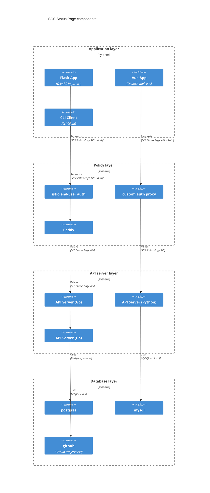

# Components

Illustrating multiple interchangable logical "layers" of possible Status Page application stacks:

Note that not everything that is shown here, actually exists or was tested. It is just shown for illustration purposes.
